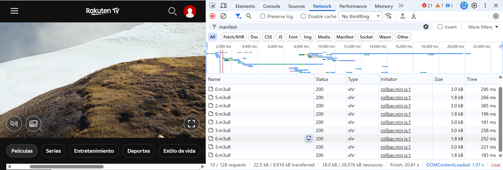
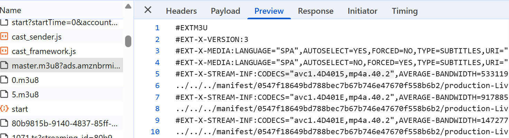
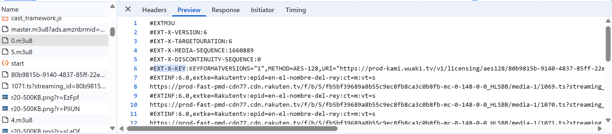

# Task 4: VOD Platform Streaming Report

In this task, we investigated the streaming technology used by Rakuten TV. We had to determine whether it used HLS or DASH for streaming, which video codec is used, and if DRM protection is applied to the content.

To check this, we reproduced a content from Rakuten (pelis TOP) and using the 'Inspect' Network tab we could see the network requests made by the platform while streaming a video. 

## Streaming Protocol
We found several .m3u8 files being fetched, which indicates that Rakuten TV uses HLS for streaming. This can be seen in this screenshot:

## Codec:

The CODECS attribute, which describes the media codecs, is found within the #EXT-X-STREAM-INF tag in the master playlist.

The CODECS="avc1.4D4015,mp4a.40.2" indicates that the video uses the H.264 codec (avc1.4D4015), and the audio uses the AAC codec (mp4a.40.2).

Moreover, we can observe that each stream is linked to a different .m3u8 file (0.m3u8, 1.m3u8, 2.m3u8), which contains the actual media segments for video playback at different qualities, as seen in theory lectures.

## DRM:

#EXT-X-KEY tag in the manifest file indicates that DRM is being used for the video stream.

* METHOD=AES-128: This indicates that AES-128 encryption is being used to encrypt the video content. AES = Advanced Encryption Standard. 

* URI="https://prod-kami.wuaki.tv/v1/licensing/aes128/80b9815b-9140-4837-85ff-22e6cef7918b?..." is the URL from which the player can get the license for decrypting the video content.

The AES-128 encryption method and the license server URL confirm that DRM protection is being applied to the content.
